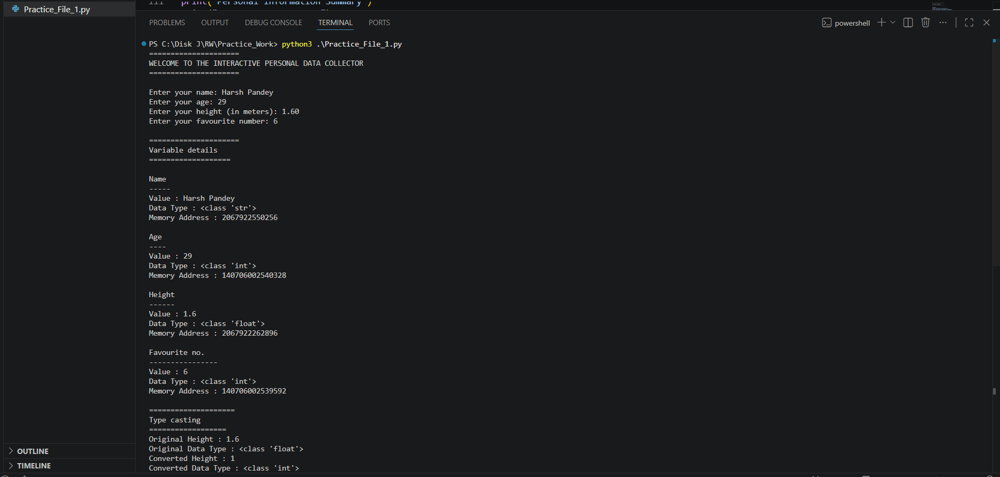
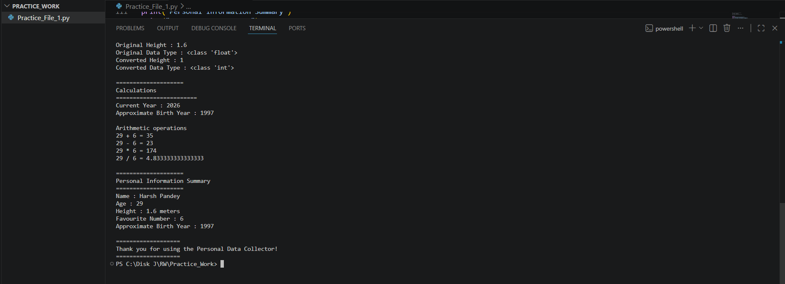

# Fundamental Booster - Personal Data Collector


## Screenshots

### Output 1



### Output 2



## Project Description

This project is a Python console application that collects personal information from the user and demonstrates Python fundamentals including:

- print()
- input()
- Variables
- Data Types
- Type Casting
- Operators
- type()
- id()
- Formatted Output

## Features

- Collects user name
- Collects age
- Collects height
- Collects favourite number
- Calculates approximate birth year
- Demonstrates arithmetic operators
- Shows variable data types
- Shows memory addresses
- Demonstrates type conversion
- Displays a formatted summary

## Assumptions

- Current year is assumed to be 2026.
- Birth year is approximate because the program does not ask for the user's birth month or day.
- Users are expected to enter valid numeric values for age, height, and favourite number.

## Technologies Used

- Python 3

## How to Run

1. Install Python 3.
2. Open a terminal in the project folder.
3. Run:

```bash
python Practice_File_1.py