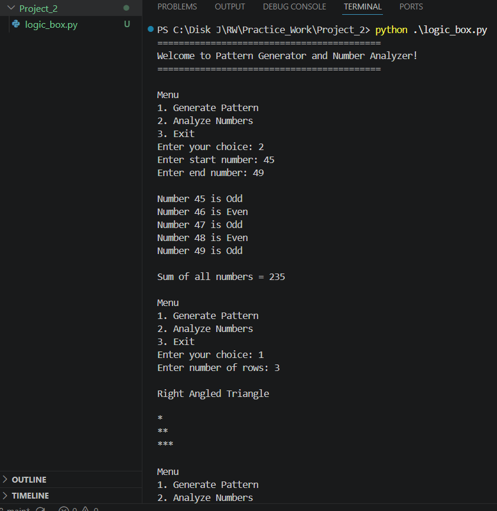
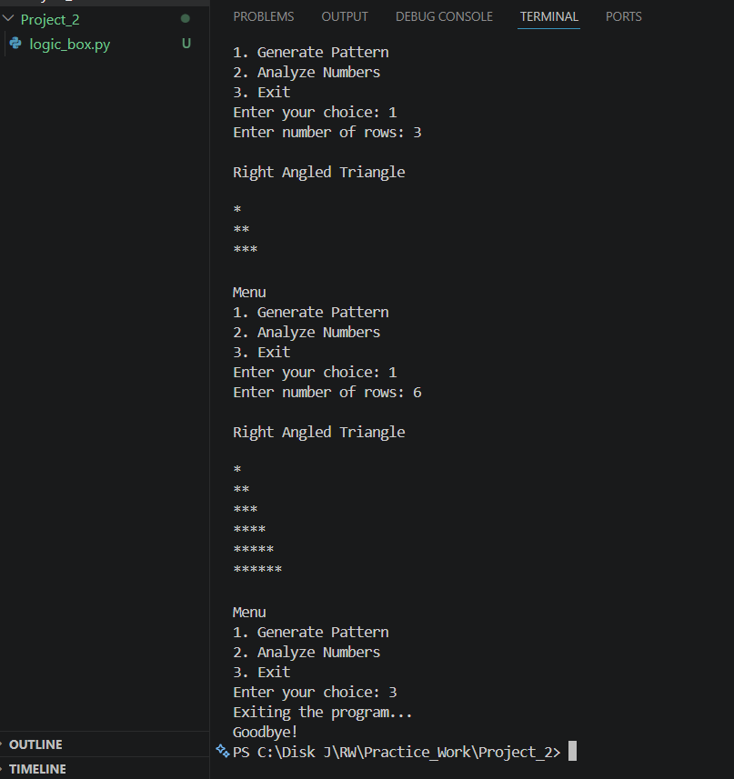

# Logic Box

## Project Name
Pattern Generator and Number Analyzer

## Features
- Menu Driven Program
- Right Angled Triangle Pattern
- Odd and Even Number Check
- Sum of Numbers
- Uses for loop
- Uses while loop
- Uses nested loop
- Uses break, continue and pass
- Input validation

## Screenshots

### Output 1

### Output 2

## Language
Python

## How to Run
1. Open terminal.
2. Run:

python logic_box.py

3. Select a menu option.

## Assumptions
- Rows must be greater than 0.
- End number must be greater than or equal to start number.