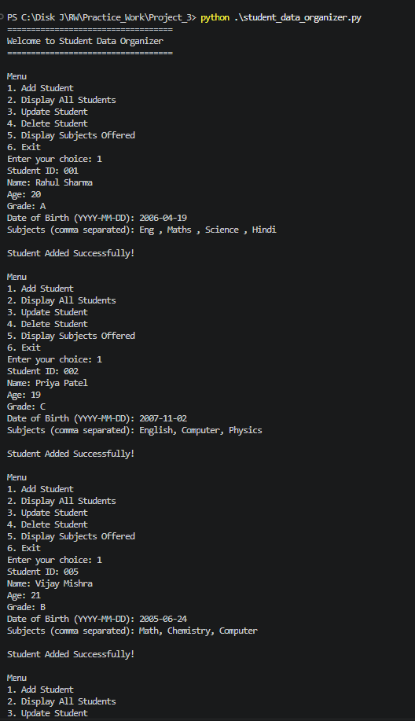
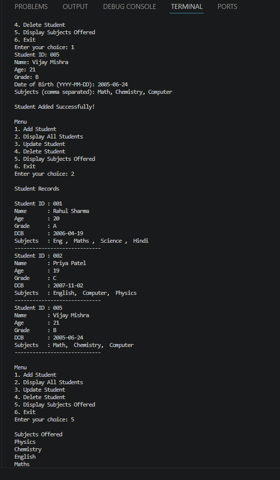
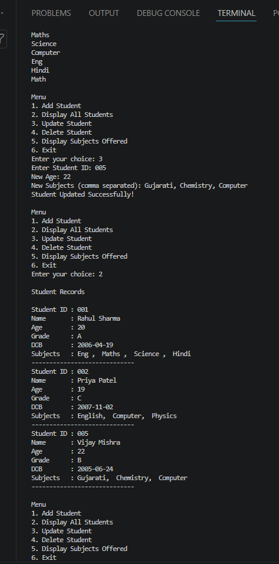
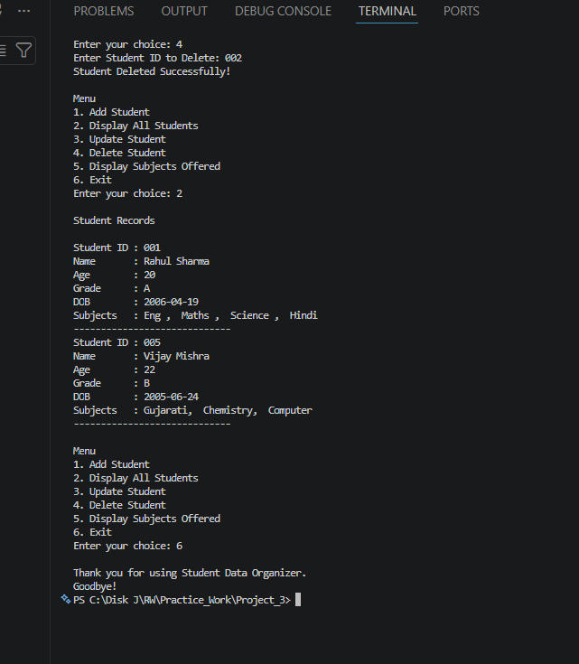

# Student Data Organizer

## Project
Collection Manipulator

## Screenshots

### Output 1



### Output 2



### Output 3



### Output 4




## Features
- Add Student
- Display Students
- Update Student
- Delete Student
- Display Unique Subjects
- Menu Driven Program

## Collections Used

### List
Stores all student tuples.

### Tuple
Stores Student ID and Date of Birth.

### Dictionary
Stores student details.

### Set
Stores unique subjects.

## Concepts Used

- String Formatting
- Type Casting
- List
- Tuple
- Set
- Dictionary
- del Keyword
- while Loop
- if Statement

## How to Run

```bash
python student_data_organizer.py
```

## Assumptions

- Student ID is unique.
- Age is entered as a number.
- Subjects are entered separated by commas.