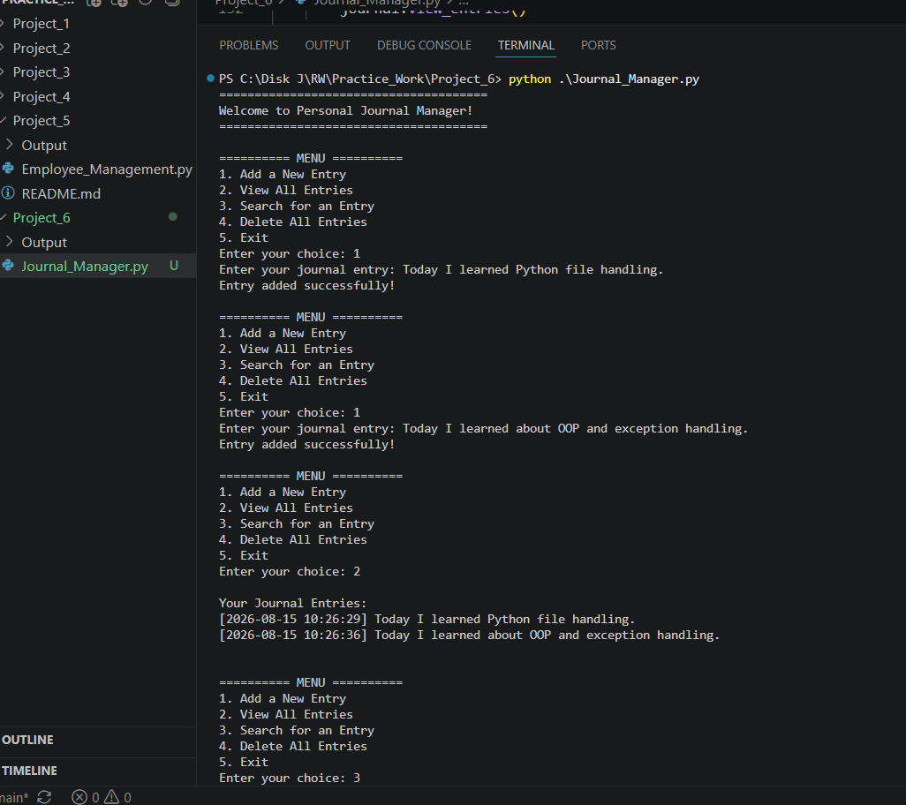
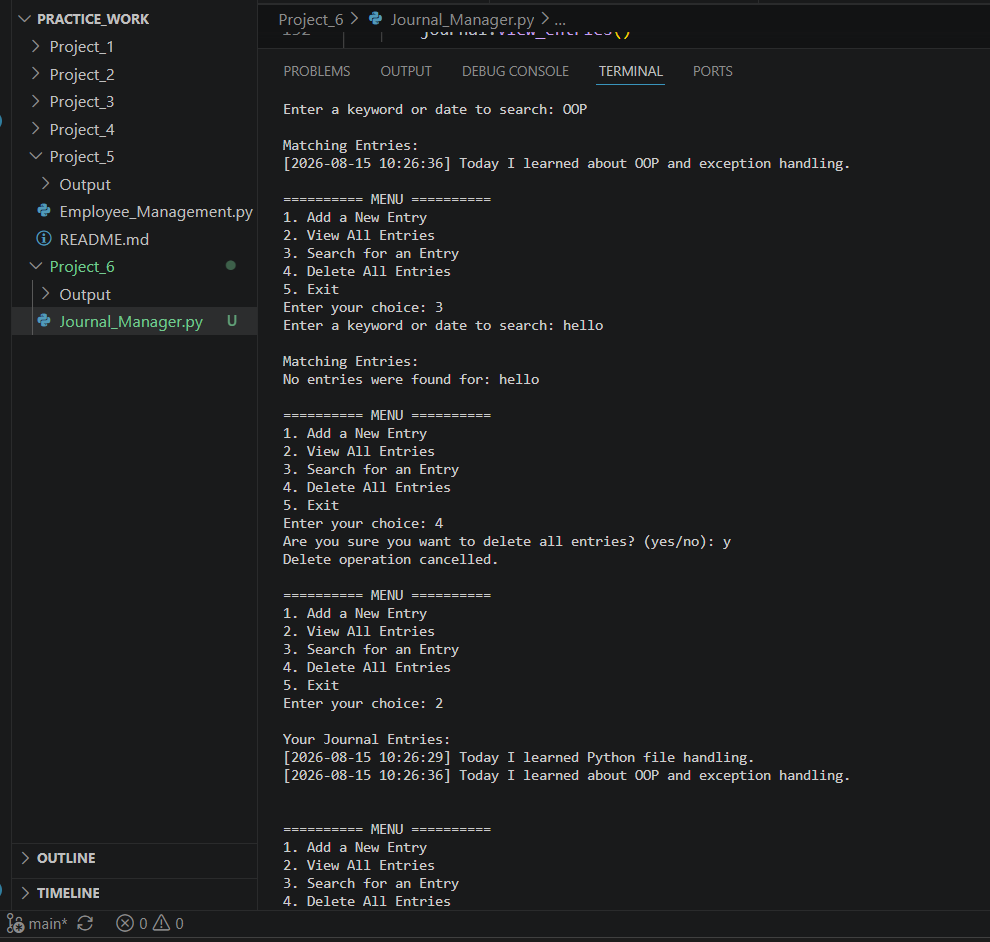
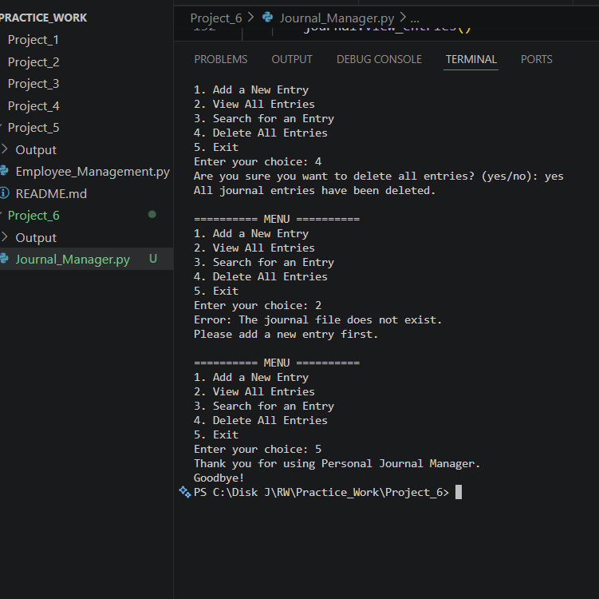

# 📔 Personal Journal Manager

> **A simple Python-based journal application for creating, viewing, searching, and managing personal journal entries.**

---

## 🧩 Project

**Project Name:** File Operator  
**Application:** Personal Journal Manager  
**Language:** Python  
**File Type:** `.txt`

---

## 📸 Project Screenshots

### 📝 Output 1 — Adding Journal Entries



### 📖 Output 2 — Viewing & Searching Entries



### 🗑️ Output 3 — Deleting & Handling Errors



---

## ✨ Features

| Feature | Description |
|---|---|
| 📝 Add Entry | Add a new journal entry with a timestamp |
| 📖 View Entries | Display all saved journal entries |
| 🔎 Search | Find entries using a keyword or date |
| 🗑️ Delete | Delete all journal entries with confirmation |
| ⚠️ Error Handling | Handles common file-related errors |
| 🖥️ Menu System | Simple menu-driven interface |
| 🚪 Exit | Safely exit the application |

---

## 🏗️ OOP Structure

The application is built using a simple Object-Oriented Programming structure.

### `JournalManager`

The `JournalManager` class controls all journal operations.

```python
class JournalManager:
```

The class contains the following methods:

```text
add_entry()
view_entries()
search_entry()
delete_entries()
```

An object is created using:

```python
journal = JournalManager()
```

---

## 📂 File Handling

All journal entries are stored in:

```text
journal.txt
```

The project demonstrates the four important Python file modes:

### `x` — Create

Creates a new file when the journal does not already exist.

```python
open(self.file, "x")
```

### `a` — Append

Adds new entries without deleting existing entries.

```python
open(self.file, "a")
```

### `r` — Read

Reads existing journal entries.

```python
open(self.file, "r")
```

### `w` — Write

Clears the file before the journal is deleted.

```python
open(self.file, "w")
```

---

## 🕒 Journal Entry Format

Every entry automatically receives the current date and time.

Example:

```text
[2026-08-15 10:30:20] Today I learned Python file handling.
```

This is created using:

```python
datetime.now()
```

---

## 🛡️ Exception Handling

The program uses exception handling to prevent unexpected crashes.

### FileNotFoundError

Handles situations where `journal.txt` does not exist.

### FileExistsError

Handles situations where the file already exists while using `x` mode.

### PermissionError

Handles situations where the program does not have permission to access the file.

Example:

```python
try:
    # File operation
except FileNotFoundError:
    # Error message
```

---

## 🎯 Program Menu

```text
======================================
Welcome to Personal Journal Manager!
======================================

========== MENU ==========
1. Add a New Entry
2. View All Entries
3. Search for an Entry
4. Delete All Entries
5. Exit
```

---

## 🔄 How the Program Works

```text
             ┌───────────────────┐
             │  Start Program    │
             └─────────┬─────────┘
                       ↓
             ┌───────────────────┐
             │    Main Menu      │
             └─────────┬─────────┘
                       ↓
       ┌───────────────┼───────────────┐
       ↓               ↓               ↓
   Add Entry       View/Search      Delete
       │               │               │
       ↓               ↓               ↓
   journal.txt     journal.txt     Delete File
       │               │               │
       └───────────────┼───────────────┘
                       ↓
                  Exit Program
```

---

## 🧠 Concepts Demonstrated

- Python OOP
- Class
- Object
- Constructor
- Instance Methods
- File Handling
- `r` Read Mode
- `w` Write Mode
- `a` Append Mode
- `x` Create Mode
- Exception Handling
- `FileNotFoundError`
- `FileExistsError`
- `PermissionError`
- `datetime`
- `os` Module
- User Input
- `while` Loop
- Conditional Statements
- Menu-Driven Programming

---

## ▶️ How to Run

Open the project folder in the terminal and run:

```bash
python Journal_Manager.py
```

The program will display the Personal Journal Manager menu.

---

## 📁 Project Structure

```text
Project/
│
├── Journal_Manager.py
├── README.md
│
├── journal.txt
│
└── Output/
    ├── Output1.png
    ├── Output2.png
    └── Output3.png
```

> `journal.txt` is created automatically when the first journal entry is added.

---

## 📌 Assumptions

- The application works only with text files.
- The journal file is named `journal.txt`.
- Empty entries are not allowed.
- Each entry receives an automatic timestamp.
- The user must confirm before deleting all entries.
- Search is case-insensitive.
- The journal file is created automatically when the first entry is added.
- The application is designed as a simple beginner-friendly Python project.

---

## 🚀 Learning Outcome

Through this project, the following concepts are practiced:

**File Handling → OOP → Exception Handling → User Input → Menu-Driven Programming**

The project demonstrates how Python can be used to build a small real-world application using files and Object-Oriented Programming.

---

## 👨‍💻 Project

**Personal Journal Manager**

*Created as part of the Python File Operator assignment.*