# 🧰 Multi-Utility Toolkit

> A beginner-friendly Python project demonstrating built-in modules, custom modules, packages, file operations, and modular programming.

---

## 📌 Project

**Project Name:** Moduler & Packager  
**Application:** Multi-Utility Toolkit  
**Language:** Python

The Multi-Utility Toolkit is a menu-driven Python application that combines different utilities into one program.

The project demonstrates how Python programs can be divided into separate modules and packages to make the code organized, reusable, and easier to manage.

---

# ✨ Features

The toolkit provides the following features:

- 🕐 Date and time operations
- ⏱️ Stopwatch and countdown timer
- 🧮 Mathematical calculations
- 📐 Trigonometric calculations
- 💰 Compound interest calculation
- 🎲 Random number generation
- 🔐 Random password generation
- 🔢 Random OTP generation
- 🎯 Random sampling
- 🆔 UUID4 generation
- 📁 File creation and management
- 🔍 Dynamic module exploration using `dir()`
- 📦 Custom Python package
- 🧩 Custom modules
- 🖥️ Menu-driven interface

---

# 🖼️ Project Screenshots

All project output screenshots are stored inside the `Output` folder.

## Output 1 — Main Menu

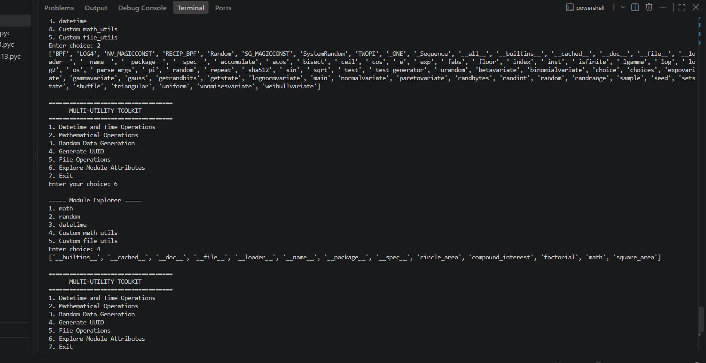

## Output 2 — Date and Time Operations

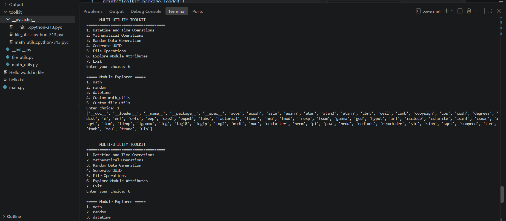

## Output 3 — Date Difference and Formatting

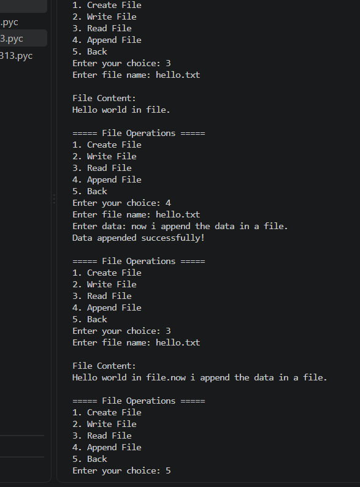

## Output 4 — Mathematical Operations

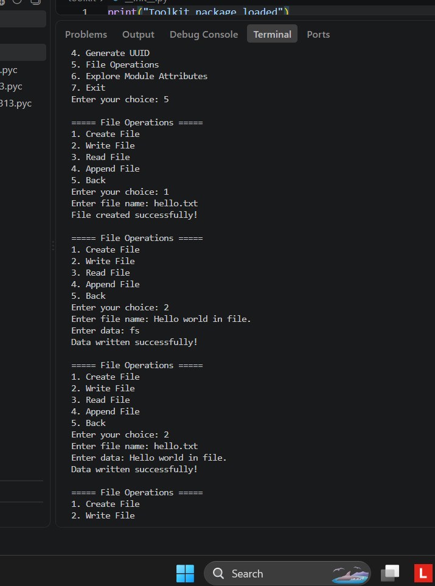

## Output 5 — Trigonometry and Area Calculations

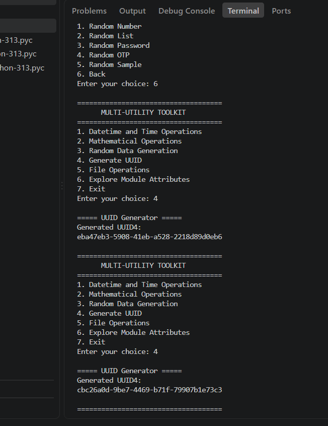

## Output 6 — Random Number and Random List

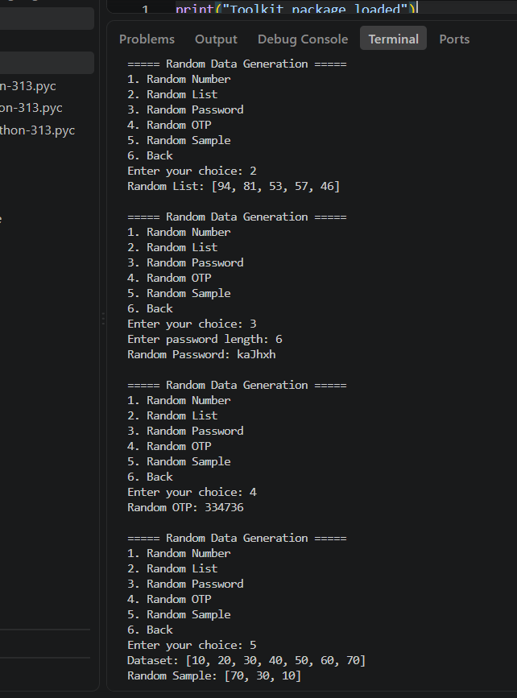

## Output 7 — Random Password and OTP

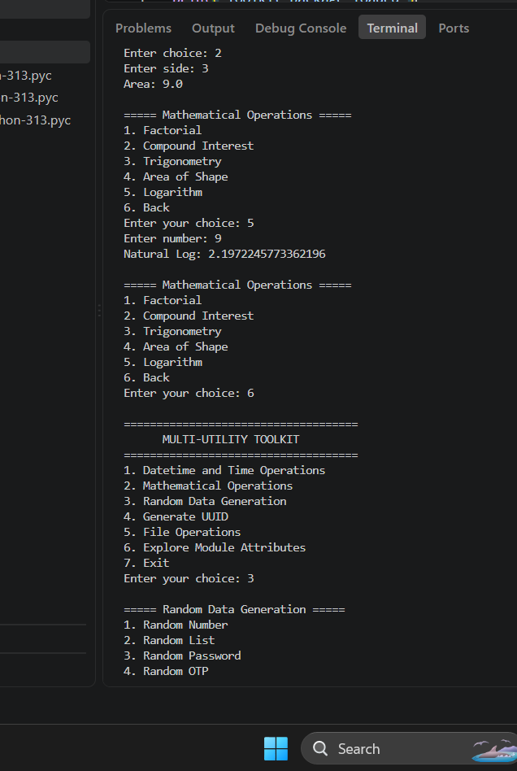

## Output 8 — Random Sampling

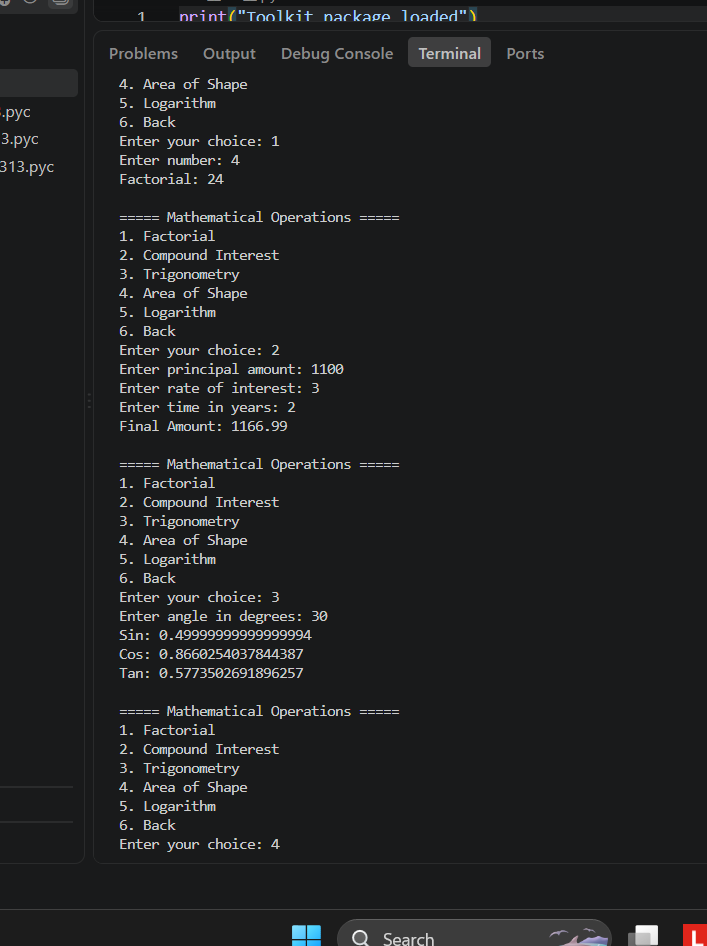

## Output 9 — UUID Generation

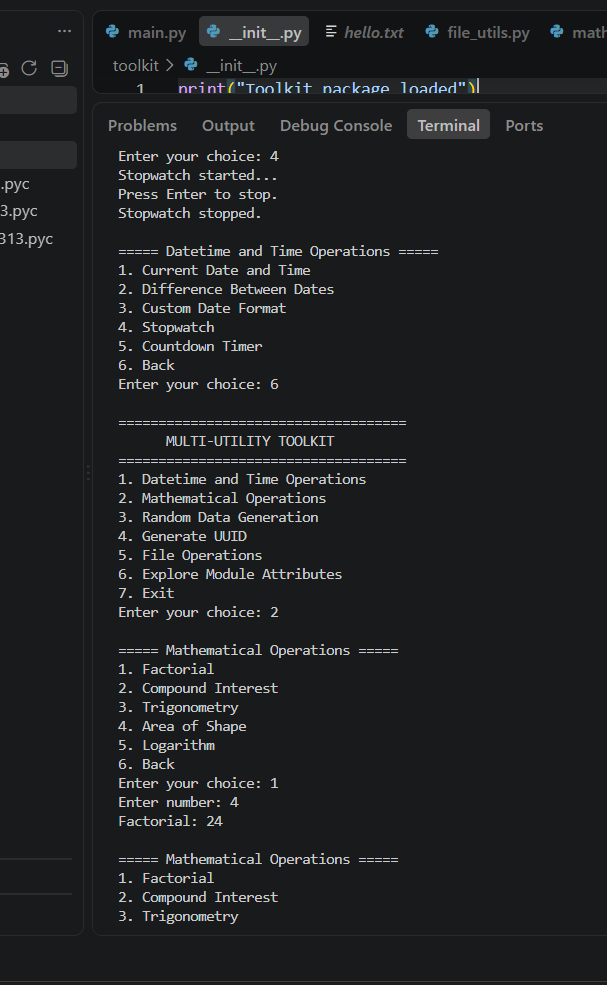

## Output 10 — File Operations

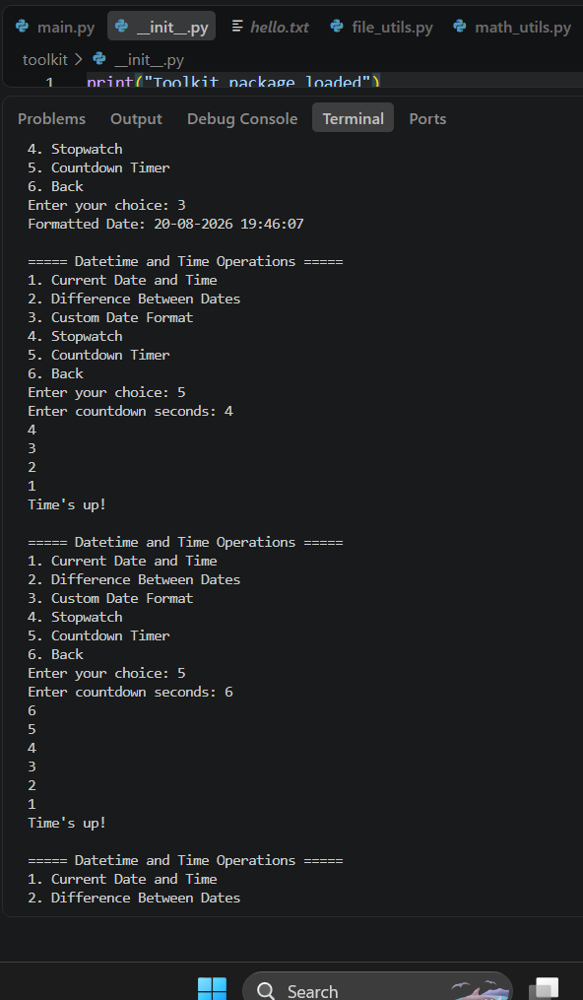

## Output 11 — File Reading and Appending

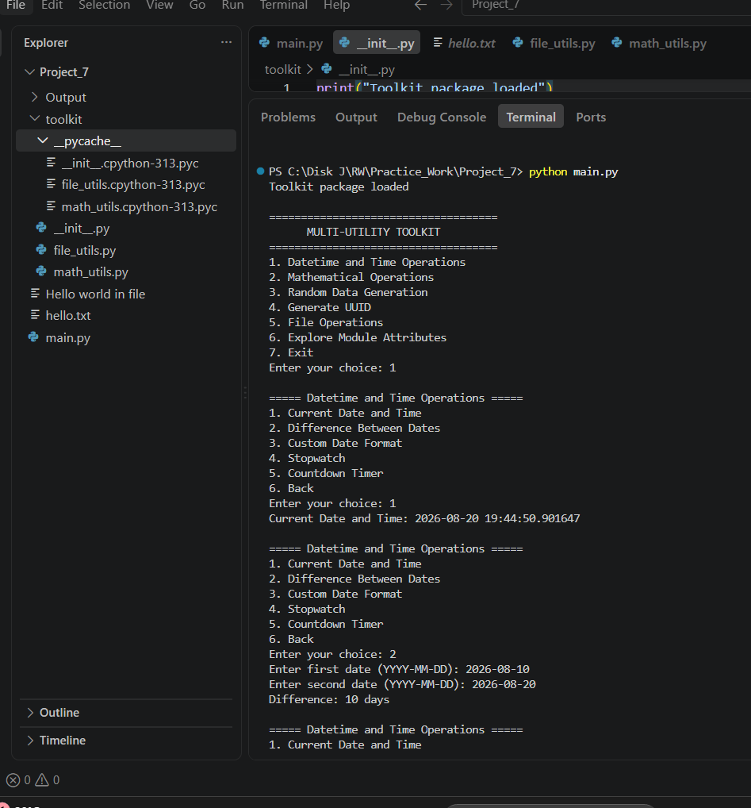

## Output 12 — Module Exploration Using `dir()`

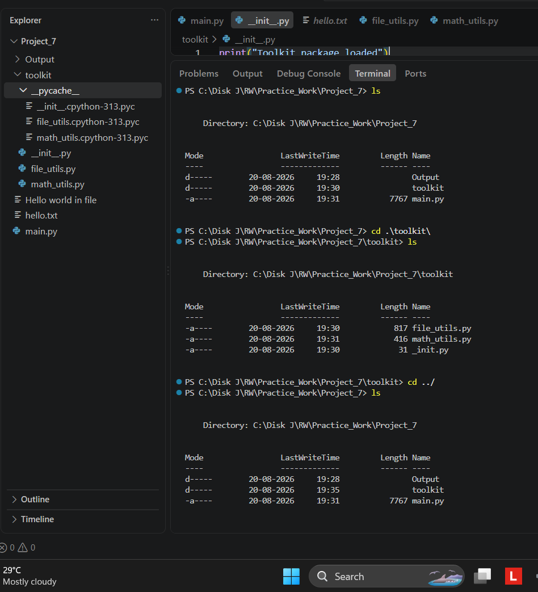

## Output 13 — Custom Module Exploration and Exit

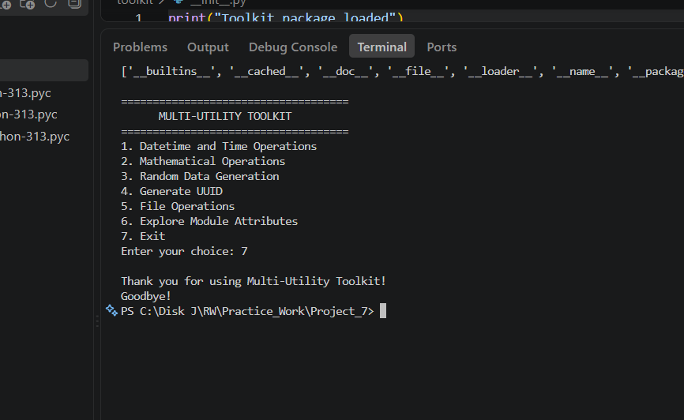


---

# 🧩 Custom Package

The project contains a custom package named:

```text
toolkit
```

The package contains:

```text
toolkit/
├── __init__.py
├── file_utils.py
└── math_utils.py
```

### `__init__.py`

The `__init__.py` file initializes the custom Python package.

### `file_utils.py`

Contains custom functions for:

- Creating files
- Writing files
- Reading files
- Appending data to files

### `math_utils.py`

Contains custom mathematical functions for:

- Factorial
- Compound interest
- Circle area
- Square area

---

# 🐍 Built-in Modules Used

## `datetime`

Used for:

- Current date and time
- Finding difference between dates
- Formatting dates

Example:

```python
datetime.datetime.now()
```

and:

```python
strftime()
```

---

## `time`

Used for:

- Countdown timer
- Stopwatch functionality

Example:

```python
time.sleep(1)
```

---

## `math`

Used for:

- Factorial
- Trigonometry
- Logarithm
- Mathematical calculations
- Area calculations

Examples:

```python
math.factorial()
math.sin()
math.cos()
math.tan()
math.log()
math.pi
```

---

## `random`

Used for:

- Random numbers
- Random lists
- Random passwords
- Random OTPs
- Random sampling

Examples:

```python
random.randint()
random.choice()
random.sample()
```

---

## `uuid`

Used to generate unique identifiers.

Example:

```python
uuid.uuid4()
```

---

# 📁 File Operations

The custom `file_utils.py` module demonstrates different file modes.

### Create File

Uses:

```python
open(name, "x")
```

The `x` mode creates a new file.

### Write File

Uses:

```python
open(name, "w")
```

The `w` mode writes data to a file and can replace existing content.

### Read File

Uses:

```python
open(name, "r")
```

The `r` mode reads existing file content.

### Append File

Uses:

```python
open(name, "a")
```

The `a` mode adds new content to the end of a file.

---

# 🔍 Dynamic Module Exploration

The project uses Python's `dir()` function to explore available attributes inside modules.

The program can explore:

```text
math
random
datetime
math_utils
file_utils
```

Example:

```python
dir(math)
```

This displays the functions, variables, and other attributes available in the selected module.

---

# 🏗️ Modular Programming

Instead of keeping every operation inside one Python file, the project separates related functionality.

```text
main.py
   │
   ├── datetime operations
   ├── time operations
   ├── random operations
   ├── UUID operations
   ├── menu system
   │
   └── toolkit package
          │
          ├── file_utils.py
          └── math_utils.py
```

This makes the project:

- Easier to understand
- Easier to maintain
- More organized
- More reusable

---

# 🏷️ `__name__` and `__main__`

The main program uses:

```python
if __name__ == "__main__":
    main()
```

This ensures that the main program starts when `main.py` is executed directly.

It also allows the file to be imported without automatically running the main program.

---

# 🖥️ Menu

The main menu provides the following options:

```text
====================================
      MULTI-UTILITY TOOLKIT
====================================

1. Datetime and Time Operations
2. Mathematical Operations
3. Random Data Generation
4. Generate UUID
5. File Operations
6. Explore Module Attributes
7. Exit
```

---

# ▶️ How to Run

Open the terminal inside the project folder:

```text
Project_7
```

Run:

```bash
python main.py
```

The Multi-Utility Toolkit menu will appear.

---

### Explore a Module

```text
Enter your choice: 6

===== Module Explorer =====

1. math
2. random
3. datetime
4. Custom math_utils
5. Custom file_utils
```

---

# 🎯 Concepts Demonstrated

This project demonstrates the following Python concepts:

- Built-in modules
- Custom modules
- Python packages
- `__init__.py`
- Importing modules
- `datetime`
- `time`
- `math`
- `random`
- `uuid`
- File handling
- `r` file mode
- `w` file mode
- `a` file mode
- `x` file mode
- `dir()`
- `__name__`
- `__main__`
- Functions
- Loops
- Conditional statements
- User input
- Menu-driven programming

---

# 📊 Requirement Coverage

| Assignment Requirement | Implementation |
|---|---|
| `datetime` module | ✅ |
| `time` module | ✅ |
| `math` module | ✅ |
| `random` module | ✅ |
| `uuid` module | ✅ |
| Current date/time | ✅ |
| Date difference | ✅ |
| `strftime()` | ✅ |
| Stopwatch | ✅ |
| Countdown | ✅ |
| Factorial | ✅ |
| Compound Interest | ✅ |
| Trigonometry | ✅ |
| Geometric Areas | ✅ |
| Logarithm | ✅ |
| Random Numbers | ✅ |
| Random Lists | ✅ |
| Random Password | ✅ |
| Random OTP | ✅ |
| Random Sampling | ✅ |
| UUID4 | ✅ |
| Custom File Module | ✅ |
| Custom Math Module | ✅ |
| Package | ✅ |
| `__init__.py` | ✅ |
| `dir()` exploration | ✅ |
| `__name__ == "__main__"` | ✅ |
| Menu-driven interface | ✅ |

---

## 🚀 Thank You

Thank you for using the **Multi-Utility Toolkit**.

```text
       Thank You!
       Goodbye!

```