# 🔢 NumPy Analyzer

> A Python-based data analysis project built with NumPy and Object-Oriented Programming (OOP).

NumPy Analyzer is a **menu-driven Python application** designed to demonstrate practical data analysis and array manipulation using **NumPy**.

The project covers a wide range of NumPy operations, including **array creation, indexing, slicing, mathematical operations, searching, sorting, filtering, statistics, percentiles, correlation, combining, and splitting arrays**.

It also demonstrates important **Object-Oriented Programming concepts** such as classes, objects, constructors, encapsulation, class methods, and static methods.

---

## ✨ Features

### 📦 Array Creation

- Create 1D NumPy arrays
- Create 2D NumPy arrays
- Create 3D NumPy arrays
- Reshape arrays

### 🔍 Array Access & Manipulation

- Index array elements
- Slice arrays
- Combine arrays
- Split arrays
- Search for values
- Sort arrays in ascending order
- Sort arrays in descending order
- Filter values using conditions

### ➕ Mathematical Operations

- Addition
- Subtraction
- Multiplication
- Division
- Dot product
- Matrix multiplication

### 📊 Statistical Analysis

- Calculate sum
- Calculate mean
- Calculate median
- Calculate standard deviation
- Calculate variance
- Find minimum value
- Find maximum value
- Calculate percentiles
- Calculate correlation coefficient

### 🧑‍💻 OOP Concepts

- Class
- Object
- Constructor
- Encapsulation
- Private methods
- Class methods
- Static methods

### 🖥️ User Interface

- Interactive menu-driven interface
- Console-based navigation
- Easy-to-use operation menu

---

## 📸 Project Screenshots

### 1️⃣ Array Creation

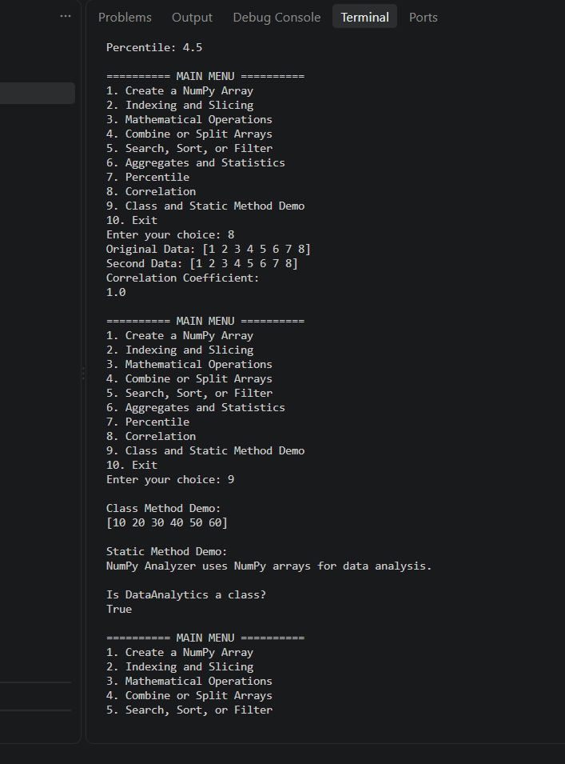

### 2️⃣ Indexing

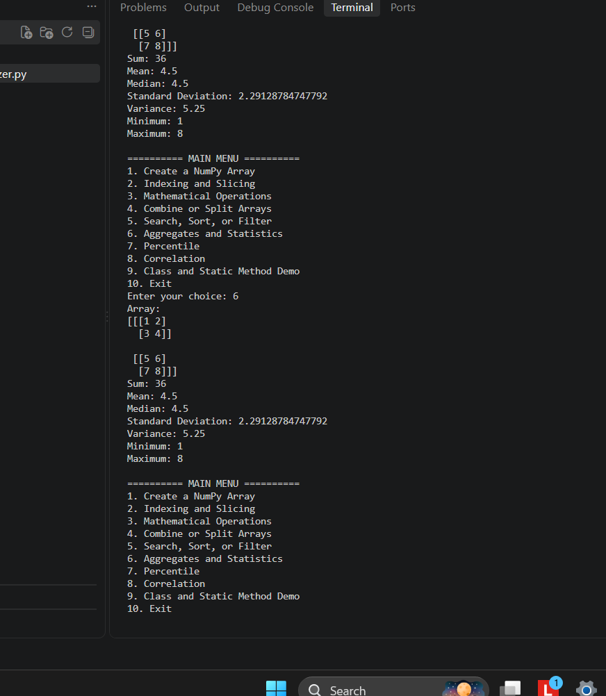

### 3️⃣ Slicing

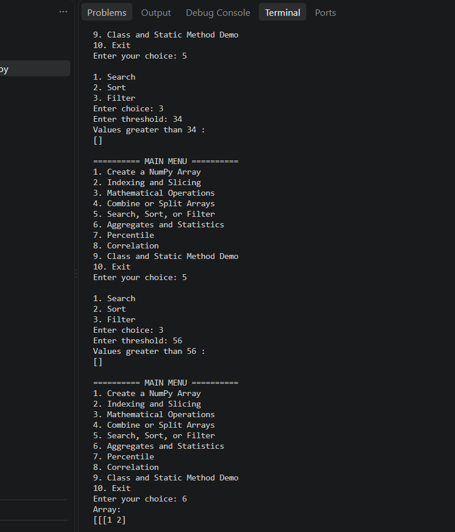

### 4️⃣ Searching

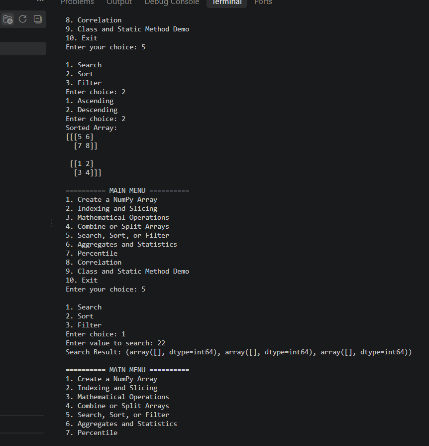

### 5️⃣ Sorting

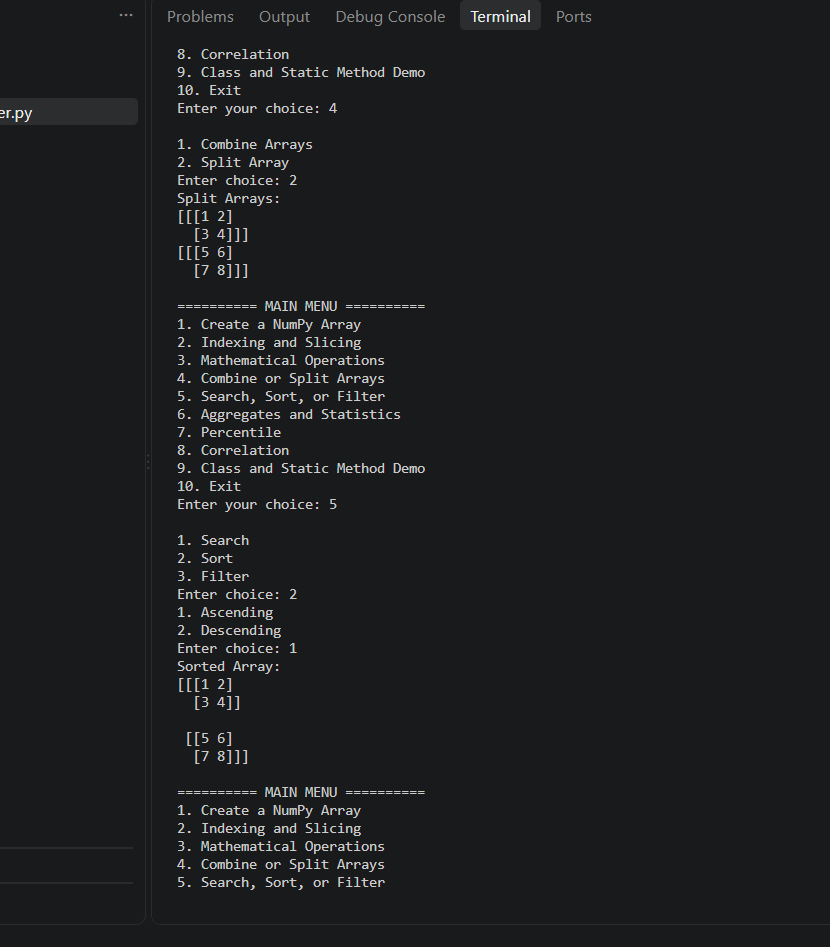

### 6️⃣ Filtering

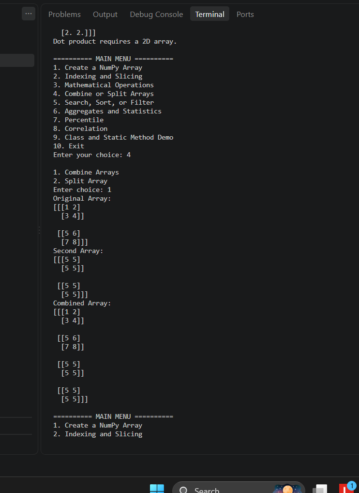

### 7️⃣ Percentile

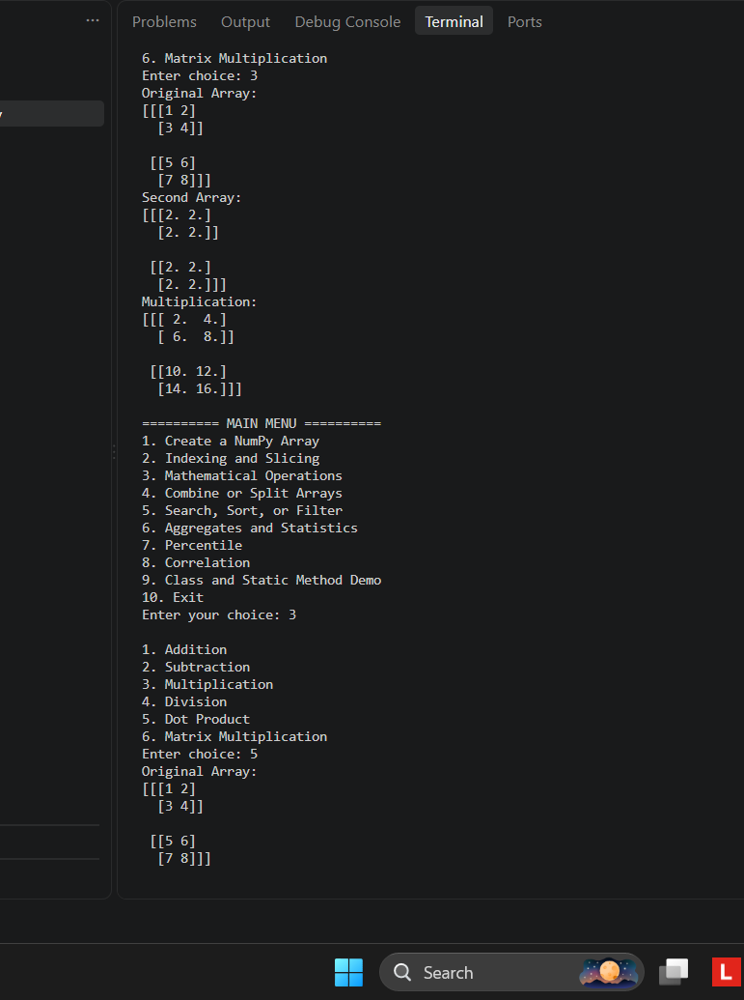

### 8️⃣ Mathematical Operations

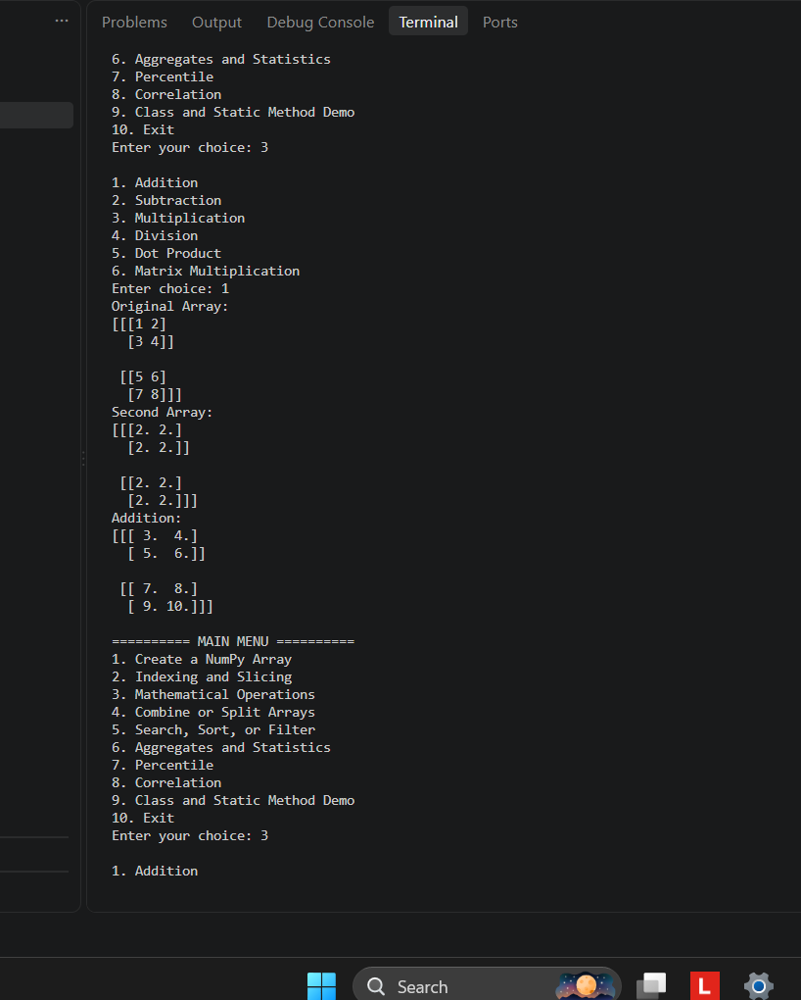

### 9️⃣ Combine and Split Arrays

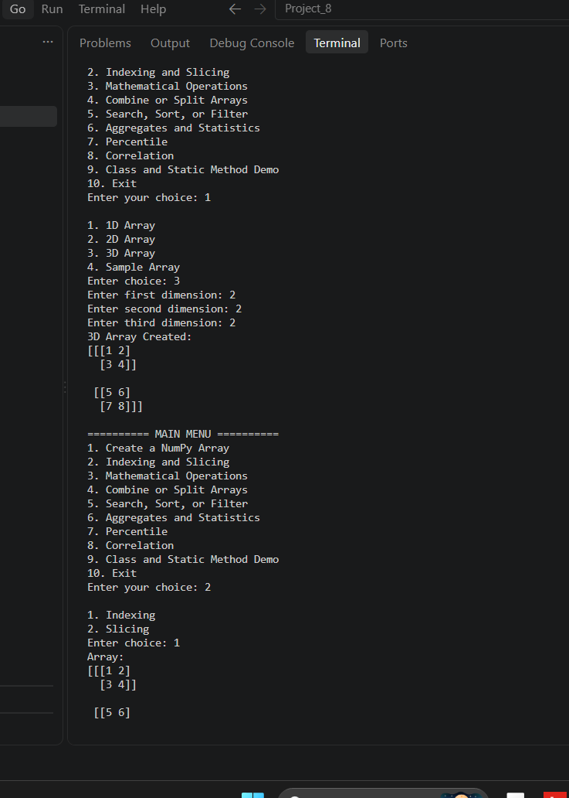

### 🔟 Aggregates and Statistics

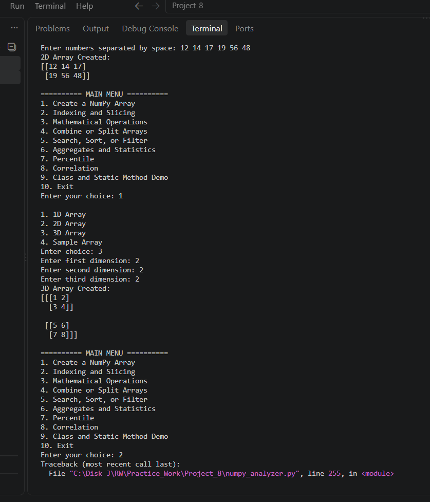

### 1️⃣1️⃣ Correlation

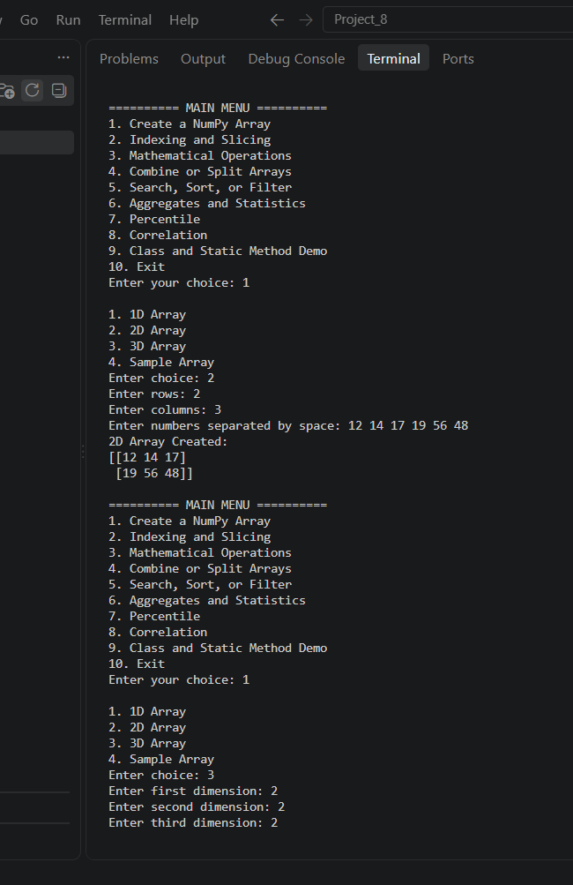

### 1️⃣2️⃣ Class Method

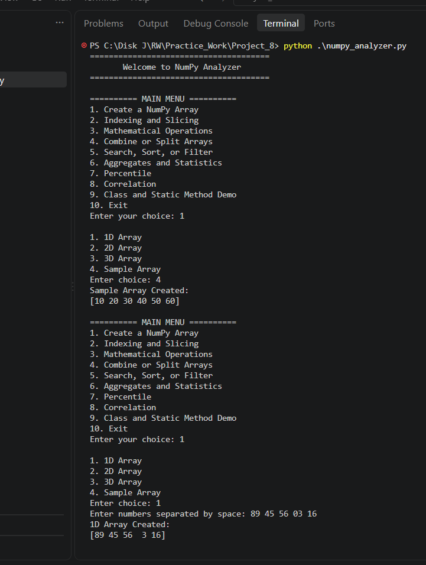

### 1️⃣3️⃣ Static Method

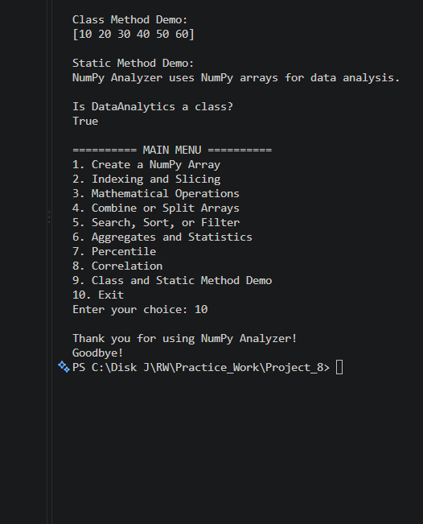

---

## 🧠 OOP Concepts Used

### 🏛️ Class

The `DataAnalytics` class is used to organize NumPy data and operations.

```python
class DataAnalytics:
    ...
